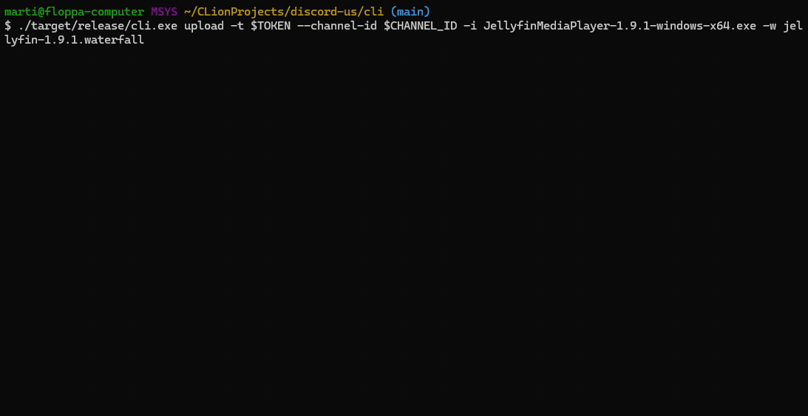

# Project killed by Discord

This project was made to abuse discord's storage system (aka Google cloud) with a highly secured system.

Thanks to [theking90000](https://github.com/theking90000) for making this project a 100 times better :)

This project was meant to be a torrent like system and was working tbh really well, after uploading thousands of gigabytes of data, discord decided to add extra "security" and this is why your discord files links has an expiration timestamp on it :c

_Maybe a Terrabyte idk but now it's a dead project_

**You should take a look at "improvemets" branch**

<br><br><br>

# Discord Unlimited Storage

## What is this?

This is a simple rust app that allows you to upload files to discord without any file size limit.
The uploaded files are saved in a format called 'Waterfall' (torrent synonym) keeping all information needed to
download the file from Discord's server.

It uses Aes256Cbc encryption to encrypt your files, so you don't have to worry about your files being analysed by
discord and tencent + it avoids discord to remove non ToS compliant files.

## Demonstration



## How to use it?

For the moment, there is 2 ways of using it: via the command line or via the lib.

### Command line

To use the command line, you need to build the executable.
```shell
cd cli && cargo build --release
```

The executable will be in `cli/target/release`.

Then you can use it like this:
```shell
cli.exe upload --token $TOKEN --channel_id $CHANNEL_ID --input file.txt --waterfall file.waterfall

cli.exe download --waterfall file.waterfall --output file.txt
```
